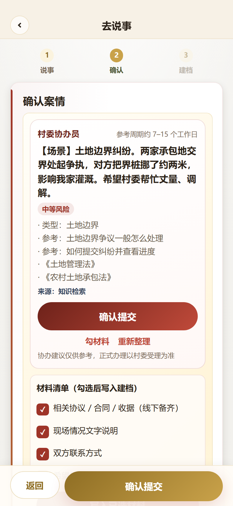
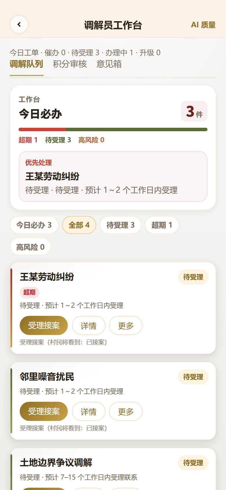
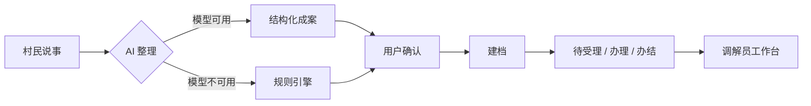

<p align="center">
  
</p>

<p align="center">
  <a href="LICENSE"></a>
  
  
  
</p>

<p align="center"><b>指尖善治（RuralTouch）</b> — 面向基层治理的微信小程序：村民「说事」建档，村委按阶段推进调解。</p>

<p align="center">
  <a href="#界面预览">界面预览</a> ·
  <a href="#快速开始">快速开始</a> ·
  <a href="#它怎么工作">架构</a> ·
  <a href="docs/DEPLOY.md">部署</a> ·
  <a href="CONTRIBUTING.md">贡献</a>
</p>

---

## 为什么做这个

村民描述纠纷时往往不会写「案由」，干部建档慢、进度不透明。  
本项目把链路收成一句：

**说事 → AI 整理成案 → 确认建档 → 待受理 / 办理 / 办结**

- AI 输出类型、风险、参考法律名称与建议步骤
- 高风险提示转村委或报警
- 大模型不可用时走**规则引擎**，演示与现场都不中断
- 普法/村务问答走**轻量检索增强**：本地知识表（26 条）关键词 Top3 + 引用展示；无 Key 时仍可仅用检索作答（**不是**向量库）
- 成案结果标注来源：规则 / 知识检索 / 大模型 / 降级

适合：基层数字化、政务 AI 落地、uni-app + 云开发、需要「可演示主链路」的产品工程样本。

---

## 界面预览

> **H5 Mock 真交互截图**（Playwright 点击 / 填写 / 滚动，非静态拼图）。重跑：[H5 Screenshots](https://github.com/Xinyu-Cui111/RuralTouch/actions/workflows/h5-screenshots.yml)

### 一眼看懂（村民说事 → AI 成案 → 干部办理）

|                登录                |             AI 确认成案              |             调解员工作台             |
| :--------------------------------: | :----------------------------------: | :----------------------------------: |
|  |  |  |

<p align="center">
  
</p>

### 产品流（真交互 · 双角色）

|                  准入                   |                五 Tab                 |                 说事成案                 |
| :-------------------------------------: | :-----------------------------------: | :--------------------------------------: |
|  |  |  |

|                高风险升级                |                 工作台                  |                AI 质量                 |
| :--------------------------------------: | :-------------------------------------: | :------------------------------------: |
|  |  |  |

### 全页目录

23 屏 Gallery（办事 / 法治 / 激励 / 好物 / 我的 / 成案 / 升级 / 工作台 / 通知 / 意见箱…）  
→ **[Gallery](docs/media/gallery/)** · 索引 **[MANIFEST](docs/media/MANIFEST.md)** · 键盘翻页 **[preview.html](docs/media/preview.html)**  
长页滚动 → [scroll/](docs/media/scroll/) · 说明 → [docs/media/README.md](docs/media/README.md)

---

## 功能一览

| 模块                | 做什么                                          |
| ------------------- | ----------------------------------------------- |
| 纠纷调解            | 场景标签、口述/文字说事、整理确认、建档、时间线 |
| 调解员工作台        | 待办队列、受理 / 办理 / 办结、高风险优先        |
| 法治服务            | 普法入口、辅助问答                              |
| 议事与反馈          | 村务通知、意见箱                                |
| 道德银行 / 惠民团购 | 积分与本地商品（辅线）                          |
| 登录与合规          | 微信登录、用户协议、隐私政策                    |

| 平台             | 技术                         | 状态                      |
| ---------------- | ---------------------------- | ------------------------- |
| 微信小程序（主） | uni-app · Vue 3 · 微信云开发 | 主链路可跑通              |
| H5 演示          | 同上 + 本地 Mock             | `npm run dev:h5` 即可预览 |

---

## 快速开始

### 环境

- Node.js 18+
- 浏览器（H5 Mock）或微信开发者工具（小程序）

### H5 演示（推荐先看，无需云环境）

```bash
git clone https://github.com/Xinyu-Cui111/RuralTouch.git
cd RuralTouch
npm install
npm run dev:h5
# 打开终端提示的本地地址，一般为 http://localhost:5173
```

未配置云环境时自动走本地 Mock：登录 → 说事 → 整理 → 建档 → 工作台。

### 微信小程序

```bash
npm install
npm run build:mp-weixin
```

1. 用微信开发者工具导入 `dist/build/mp-weixin`（不要直接导入源码根目录）
2. 在 `config/env.js` 填入云环境 ID
3. 上传并部署云函数 `cloudfunctions/rt-api`
4. 按 [docs/DEPLOY.md](docs/DEPLOY.md) 创建数据库集合

---

## 它怎么工作



```
pages/              业务页面
cloudfunctions/     rt-api 统一网关
utils/              云调用、Mock、规则与检索
docs/               部署、产品、评测、合规
screenshots/        界面与录屏
```

| 层   | 技术                                                         |
| ---- | ------------------------------------------------------------ |
| 前端 | uni-app + Vue 3 + Vite                                       |
| 后端 | 微信云开发（云函数 `rt-api` + 云数据库 `rt_*`）              |
| AI   | 大模型 JSON 结构化输出 + 规则引擎兜底 + 知识表 Top3 检索引用 |

---

## 文档

| 文档                                     | 用途               |
| ---------------------------------------- | ------------------ |
| [docs/DEPLOY.md](docs/DEPLOY.md)         | 云开发部署与提审   |
| [docs/PRODUCT.md](docs/PRODUCT.md)       | 产品定位与用户旅程 |
| [docs/DEMO.md](docs/DEMO.md)             | 演示路径           |
| [docs/EVAL.md](docs/EVAL.md)             | 纠纷整理评测       |
| [docs/LLM_SETUP.md](docs/LLM_SETUP.md)   | 大模型 Key 配置    |
| [docs/COMPLIANCE.md](docs/COMPLIANCE.md) | 合规边界           |

---

## 路线图

- [x] 说事 → 成案 → 办理主链路（小程序 + H5 Mock）
- [x] 规则引擎兜底与来源标注
- [x] 知识表 FAQ（26）+ Top3 引用；H5 Mock 与云函数同路径
- [x] 评测集公开样例与可复现脚本（纠纷 42 + FAQ 15，`npm run eval`）
- [x] 界面截图与静默录屏（`screenshots/`，含 AI 质量看板）
- [x] 管理端 AI 质量看板（H5 Mock 可演示；离线基线 42/42 · 15/15）
- [x] 3 分钟旁白脚本（[docs/DEMO.md](docs/DEMO.md)）；静默走查 `demo-walkthrough.webm`
- [ ] 有旁白 Demo 上传（按 DEMO 时间轴自录后挂 README）
- [ ] 演示环境一键说明（无 Key 场景）

欢迎在 Issues 提需求或踩坑记录。

---

## 参与贡献

见 [CONTRIBUTING.md](CONTRIBUTING.md)。Bug / 文档 / 小功能 PR 都欢迎。

## 许可证

[MIT](LICENSE) © Xinyu-Cui111
