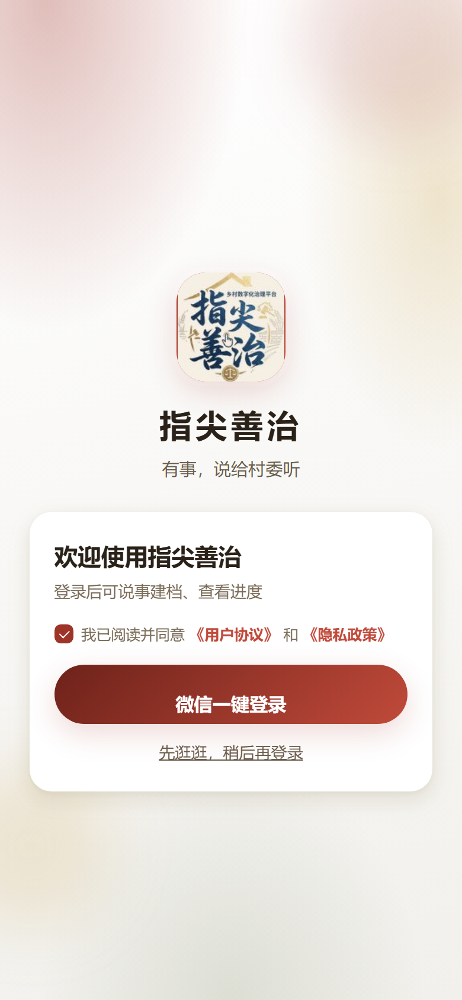
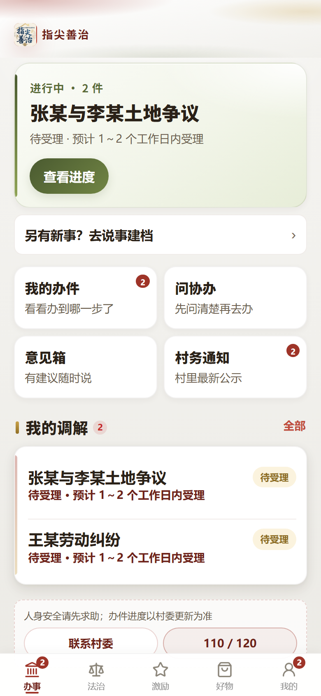
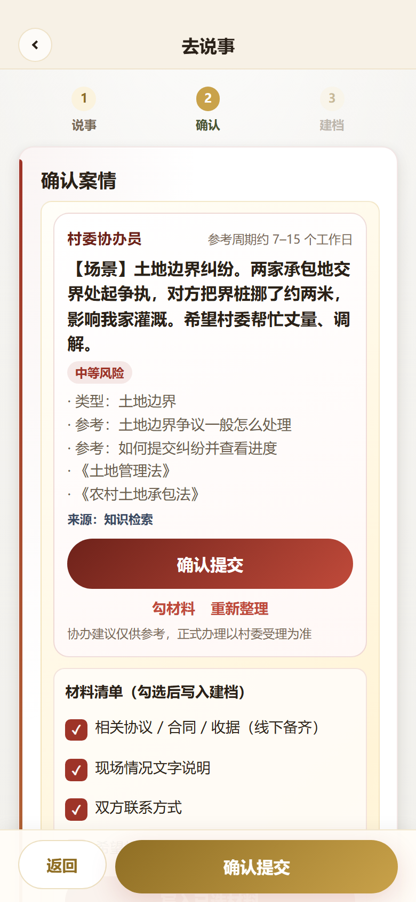
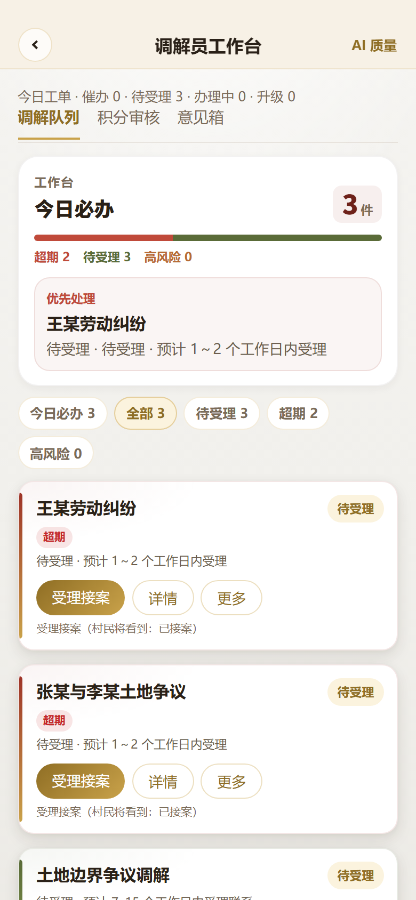
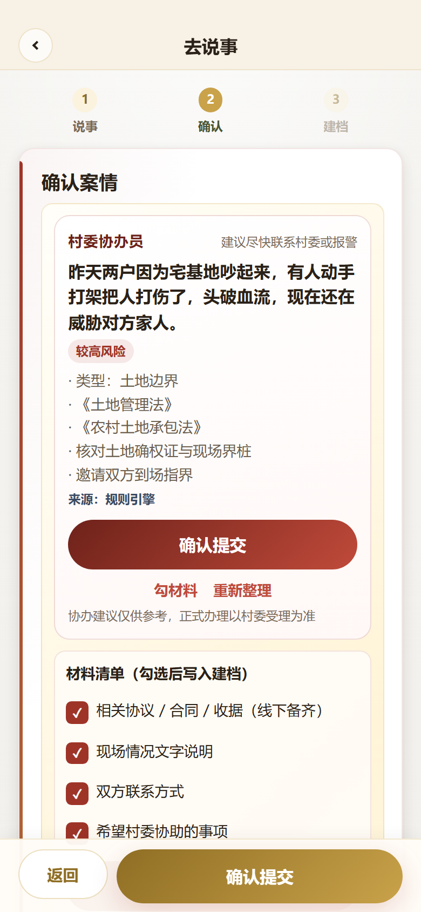
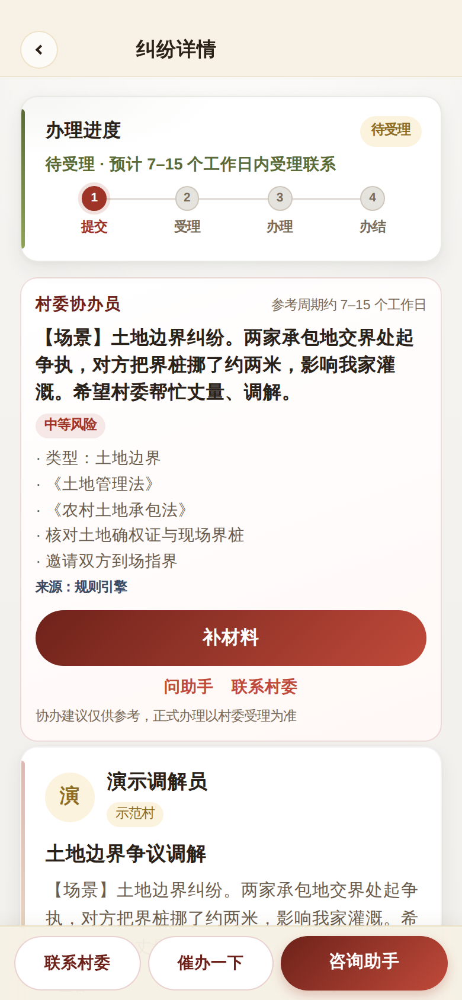
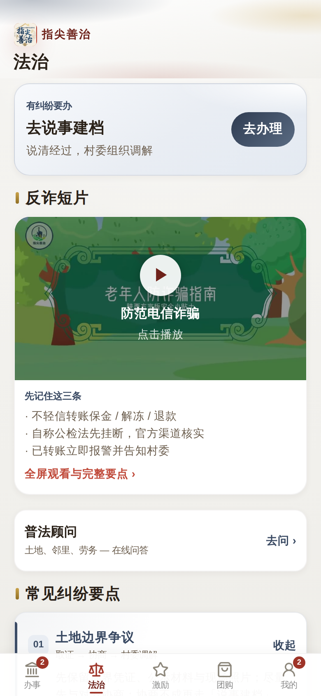
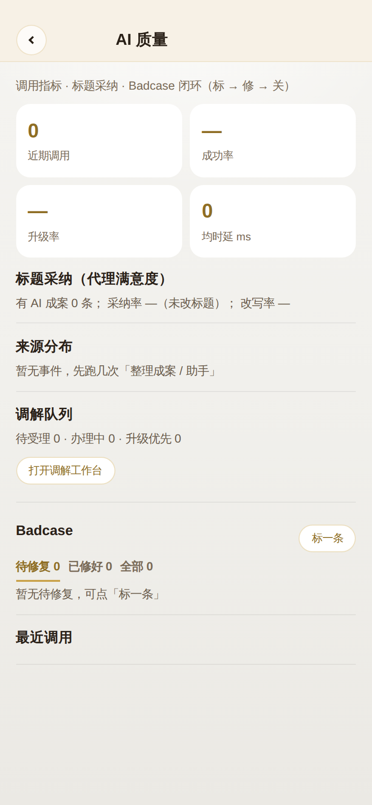

# 指尖善治（RuralTouch）

面向基层治理场景的微信小程序：村民「说事」建档，村委按阶段推进调解。

| 平台             | 技术                         | 状态                      |
| ---------------- | ---------------------------- | ------------------------- |
| 微信小程序（主） | uni-app · Vue 3 · 微信云开发 | 主链路可跑通              |
| H5 演示          | 同上 + 本地 Mock             | `npm run dev:h5` 即可预览 |

**在线仓库：** https://github.com/Xinyu-Cui111/RuralTouch

---

## 它解决什么问题

村民描述纠纷时往往不会写「案由」，干部建档慢、进度不透明。  
本项目把流程收成一条链路：

**说事 → AI 整理成案 → 确认建档 → 待受理 / 办理 / 办结**

AI 输出类型、风险、参考法律名称与建议步骤；高风险提示转村委或报警；大模型不可用时走规则引擎，演示不中断。

---

## 界面预览

|               登录                |                   首页                   |                确认成案                |            调解员工作台             |
| :-------------------------------: | :--------------------------------------: | :------------------------------------: | :---------------------------------: |
|  |  |  |  |

|              高风险确认              |                  办件进度                  |                法治                |                AI 质量                 |
| :----------------------------------: | :----------------------------------------: | :--------------------------------: | :------------------------------------: |
|  |  |  |  |

静默操作录屏：[screenshots/demo-walkthrough.webm](screenshots/demo-walkthrough.webm)

---

## 功能模块

| 模块         | 内容                                            |
| ------------ | ----------------------------------------------- |
| 纠纷调解     | 场景标签、口述/文字说事、整理确认、建档、时间线 |
| 调解员工作台 | 待办队列、受理/办理/办结、高风险优先            |
| 法治服务     | 普法入口、辅助问答                              |
| 议事与反馈   | 村务通知、意见箱                                |
| 道德银行     | 积分、申报、兑换（辅线）                        |
| 惠民团购     | 本地商品展示（辅线）                            |
| 登录与合规   | 微信登录、用户协议、隐私政策                    |

---

## 快速开始

### 环境

- Node.js 18+
- 微信开发者工具（跑小程序）
- 浏览器（跑 H5 Mock）

### H5 演示（推荐先看）

```bash
npm install
npm run dev:h5
# 浏览器打开终端提示的本地地址，一般为 http://localhost:5173
```

未配置云环境时自动使用本地 Mock，可走登录 → 说事 → 整理 → 建档 → 工作台。

### 微信小程序

```bash
npm install
npm run build:mp-weixin
```

1. 用微信开发者工具导入目录：`dist/build/mp-weixin`（不要直接导入源码根目录）
2. 在 `config/env.js` 填入云环境 ID
3. 上传并部署云函数 `cloudfunctions/rt-api`
4. 按 [docs/DEPLOY.md](docs/DEPLOY.md) 创建数据库集合

---

## 技术说明

```
前端    uni-app + Vue 3 + Vite
后端    微信云开发（云函数 rt-api + 云数据库 rt_*）
AI      大模型 JSON 结构化输出 + 规则引擎兜底 + FAQ 关键词检索
```

目录概览：

```
pages/              业务页面
cloudfunctions/     rt-api 统一网关
utils/              云调用、Mock、规则与检索
docs/               部署、产品与评测说明
screenshots/        界面截图
```

FAQ 为本地词表关键词匹配，**不是**向量库 RAG；结果页会标注来源（规则 / 模型 / 检索）。

---

## 文档

| 文档                                     | 用途               |
| ---------------------------------------- | ------------------ |
| [docs/DEPLOY.md](docs/DEPLOY.md)         | 云开发部署与提审   |
| [docs/PRODUCT.md](docs/PRODUCT.md)       | 产品定位与用户旅程 |
| [docs/DEMO.md](docs/DEMO.md)             | 演示路径           |
| [docs/EVAL.md](docs/EVAL.md)             | 纠纷整理评测       |
| [docs/LLM_SETUP.md](docs/LLM_SETUP.md)   | 大模型 Key 配置    |
| [docs/COMPLIANCE.md](docs/COMPLIANCE.md) | 合规边界           |

更细的 UI / App 迭代笔记在 `docs/` 下，日常使用不必先读。

---

## 参与贡献

见 [CONTRIBUTING.md](CONTRIBUTING.md)。Issue / PR 均欢迎。

## 许可证

[MIT](LICENSE)
