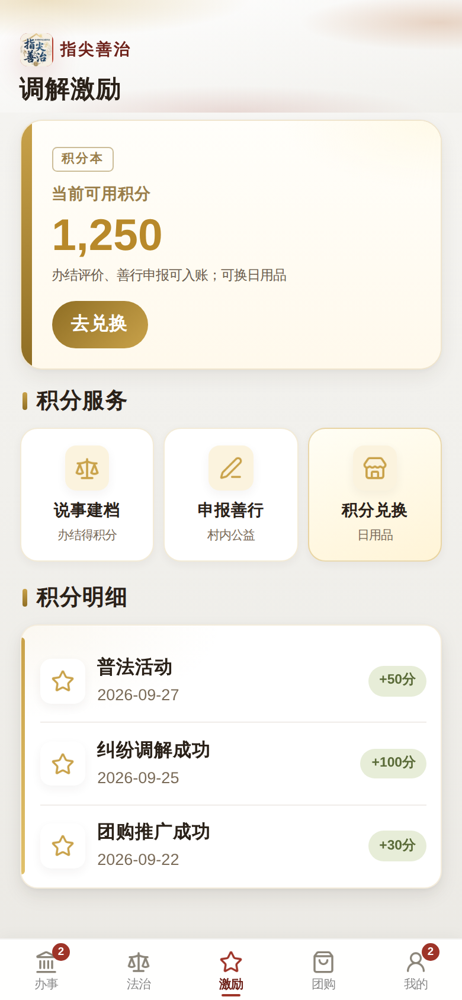

# RuralTouch / 指尖善治

[](https://uniapp.dcloud.net.cn/)
[](docs/DEPLOY.md)
[](LICENSE)

**智慧村务微信小程序** — 法治服务、村民议事、纠纷调解、道德银行、惠民团购。  
uni-app + Vue 3 前端，微信云开发后端，**已跑通登录与完整业务链路**。

| 文档                                   | 说明                                     |
| -------------------------------------- | ---------------------------------------- |
| [产品说明](docs/PRODUCT.md)            | 定位、功能地图、用户旅程、JD 映射        |
| [演示脚本](docs/DEMO.md)               | 4–6 分钟面试演示 + 截图清单              |
| [案例复盘](docs/CASE_STUDY.md)         | 面试主讲述 + 深挖问答                    |
| [合规叙事](docs/COMPLIANCE.md)         | 付费 / 运维 / 红线                       |
| [作品集包装](docs/PORTFOLIO.md)        | 录屏大纲 + 截图优先级                    |
| [UI 升级策划](docs/UI_UPGRADE_PLAN.md) | 全站简约排版分批方案                     |
| [部署指南](docs/DEPLOY.md)             | 云开发配置、提审 checklist               |
| [LLM 接入配置](docs/LLM_SETUP.md)      | DeepSeek/通义 API、管理员、云存储        |
| [性能与资源](docs/PERF.md)             | 轻量图 / 图标 / 视频外置（对齐竞品加载） |

---

## 预览

> 截图请放入 `screenshots/` 目录（见 [DEMO.md](docs/DEMO.md)）

|               登录                |                   议事厅                   |                 纠纷时间线                 |               道德银行                |
| :-------------------------------: | :----------------------------------------: | :----------------------------------------: | :-----------------------------------: |
|  |  |  |  |

_（截图待补充 — 按 DEMO.md 清单在微信开发者工具中截取）_

---

## 核心亮点

- **垂直调解 AI** — 说事 → 整理成案 → 建档 → 干部推进（非泛 Chat）
- **规则 + LLM + FAQ 检索** — 来源可见（含短缓存）；高风险升级 / 输赢拒答
- **质量闭环** — 评测集、`rt_ai_events`、AI 质量看板、Badcase 标注
- **真实可上线** — 微信云开发；用户协议 & 隐私政策齐全
- **双模式演示** — 小程序连云开发；H5 自动 Mock，面试/路演零配置

---

## 技术架构

```
前端：uni-app + Vue 3 + Vite
后端：微信云开发（云函数 rt-api + 云数据库 rt_*）
平台：微信小程序（主） / H5（演示）
```

```
pages/           14 个页面（登录、4 Tab、子页、协议）
api/             前端 API 封装 → callApi(action)
utils/           云开发 init / H5 Mock 降级
cloudfunctions/  rt-api 统一网关（login, disputes, moral…）
config/          云环境 ID
```

---

## 快速开始

```bash
npm install
npm run dev:mp-weixin   # 微信小程序开发
npm run dev:h5          # H5 演示（自动 Mock 数据）
```

### 云开发配置

1. 微信开发者工具开通云开发，复制环境 ID
2. 修改 `config/env.js` 中的 `CLOUD_ENV_ID`
3. 部署 `cloudfunctions/rt-api`（右键 → 上传并部署：云端安装依赖）
4. 创建数据库集合（见 [docs/DEPLOY.md](docs/DEPLOY.md)）
5. **导入目录：** `dist/build/mp-weixin`（不是源码根目录）

```bash
npm run build:mp-weixin   # 产物 → dist/build/mp-weixin
```

---

## 功能一览

| 模块        | 能力                                                |
| ----------- | --------------------------------------------------- |
| **AI 助手** | 村务问答、快捷建议、纠纷流程引导                    |
| 登录        | 微信一键登录、手机号登录、协议合规、首次 onboarding |
| 法治服务    | 普法内容与法律服务入口                              |
| 村民议事厅  | 村务通知、村民反馈、AI 辅助纠纷提交/记录/时间线     |
| 道德银行    | 积分总览、申报（审核制）、商城兑换                  |
| 惠民团购    | 云数据库商品展示                                    |
| 个人中心    | 用户信息、积分、退出登录                            |

---

## 面试 30 秒版

> 指尖善治是智慧村务小程序，解决村民办事和纠纷进度不透明的问题。我用 uni-app 做前端，微信云开发做后端，跑通了纠纷调解从提交到时间线追踪的完整链路，并补齐了提审需要的协议页。H5 可 Mock 演示，小程序可真实上线。

---

## 许可证

MIT
