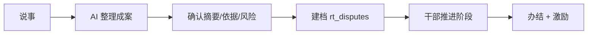

# 指尖善治 · 产品说明

> 智慧村务数字化服务平台 · 微信小程序

## 1. 产品定位

**一句话：** 把「法治服务、村民议事、纠纷调解、道德激励、惠民团购」装进村民口袋里的村务小程序。

**目标用户**

| 角色         | 痛点                           | 产品价值                         |
| ------------ | ------------------------------ | -------------------------------- |
| 普通村民     | 办事不知道找谁、纠纷进度不透明 | 一键提交、时间线追踪、通知直达   |
| 村干部       | 信息传达效率低、调解记录难留存 | 通知发布、反馈汇总、调解档案     |
| 基层治理试点 | 缺乏低成本数字化工具           | 云开发零运维、可快速复制到其他村 |

**使用场景：** 微信小程序（主）—— 覆盖中老年用户、无需下载 App；H5 演示（备）—— 浏览器 Mock 数据，适合面试/路演。

---

## 2. 功能地图

```
指尖善治
├── 登录与合规
│   ├── 微信一键登录
│   ├── 手机号登录
│   └── 用户协议 / 隐私政策
├── 法治服务（Tab）
│   ├── 普法内容展示
│   └── 法律服务入口
├── 村民议事厅（Tab）
│   ├── 村务通知列表
│   ├── 村民反馈提交
│   ├── 纠纷调解 · 提交
│   ├── 纠纷调解 · 记录列表
│   └── 纠纷详情 · 进度时间线
├── 道德银行（Tab）
│   ├── 积分总览与记录
│   ├── 积分申报
│   └── 积分商城兑换
└── 惠民团购（Tab）
    └── 本地农产品展示
```

---

## 3. 核心用户旅程

### 旅程 A：AI 辅助纠纷建档（主链路 · 面试必演示）



**关键页面：** `pages/village/submit` → `records` → `disputeDetail` → `admin/disputes`

**产品亮点：**

- AI 输出结构化 `aiMeta`（分类、风险、法律依据、步骤）
- 高风险升级提示；诉讼输赢类拒答；LLM 失败规则降级
- 简易 RAG：`faq.json` 关键词检索 → 引用 chips；来源标签（大模型 / 规则 / 检索）
- 助手/普法任务边界 + 转人工入口（村委会 / 110 / 120）
- `rt_ai_events` 记录来源与时延；评测见 `docs/EVAL.md`；案例见 `docs/CASE_STUDY.md`

### 旅程 B：村务通知 + 反馈

1. 议事厅首页 → 村务通知 → 查看公告详情
2. 议事厅 → 村民反馈 → 提交意见 → 云数据库 `rt_feedbacks`

### 旅程 C：道德银行闭环

1. 道德银行首页查看当前积分
2. 积分申报 → 提交善行记录 → `rt_moral_records`
3. 积分商城 → 选择商品 → 扣减积分兑换

---

## 4. 技术架构（产品视角）

```
┌─────────────────────────────────────────┐
│  前端 uni-app + Vue 3                    │
│  微信小程序（生产） / H5 Mock（演示）      │
└─────────────────┬───────────────────────┘
                  │ callApi(action, data)
┌─────────────────▼───────────────────────┐
│  云函数 rt-api（统一网关）                │
│  login · disputes · notices · moral …   │
└─────────────────┬───────────────────────┘
                  │
┌─────────────────▼───────────────────────┐
│  云数据库 rt_* 集合                       │
│  用户身份 OpenID · 种子数据自动初始化      │
└─────────────────────────────────────────┘
```

**为什么选微信云开发（产品决策）：**

- 村务场景用户已在微信生态，登录 friction 最低
- 个人/小团队可真实上线，无需备案服务器
- 一套 uni-app 代码，H5 可 Mock 降级演示

---

## 5. 与 JD 能力映射

| JD 要求            | 本项目体现                               |
| ------------------ | ---------------------------------------- |
| 产品规划与功能设计 | 5 大模块功能地图、3 条核心用户旅程       |
| UI / 交互          | Tab 导航、卡片列表、时间线详情、表单提交 |
| 前端实现           | uni-app + Vue 3，14 页面完整链路         |
| AI 工具落地        | Cursor 驱动从原型到云开发全栈迭代        |
| 真实需求           | 基层村务数字化，可提审上线的合规路径     |

---

## 6. 当前状态 & 后续迭代（可选）

**已完成 ✅**

- 登录、核心业务链路、云函数 API、种子数据
- 用户协议 / 隐私政策（审核合规）
- H5 Mock 降级、部署文档

**可迭代（按优先级）**

1. **管理端** — 村干部 Web 后台发通知、改纠纷状态（云函数 admin action）
2. **消息订阅** — 纠纷状态变更微信模板消息
3. **AI 辅助** — 纠纷描述智能摘要 / 调解建议（对接大模型 API）
4. **数据看板** — 本村调解率、积分排行（治理成效可视化）

---

## 7. 竞品 / 参考

- 各地「智慧乡村」「数字治理」政务小程序
- 差异点：聚焦「纠纷调解 + 道德银行」闭环，轻量云开发、个人可交付
